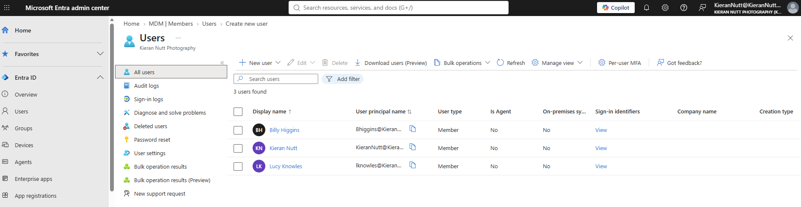
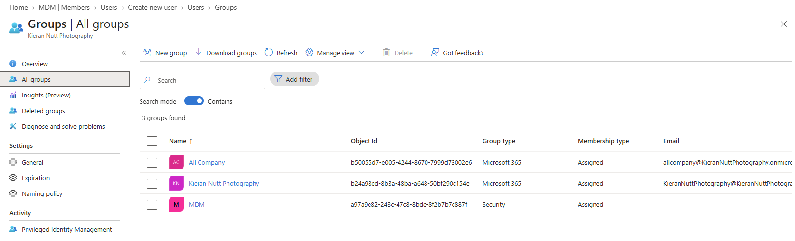
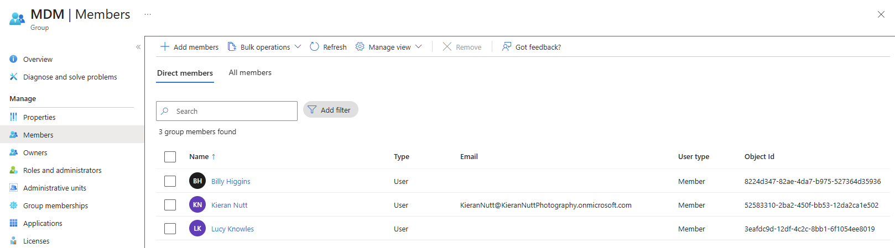

# Entra - Users and Groups

Microsoft Entra ID allows administrators to manage user identities and organise users and devices into groups.

Groups make it easier to manage access, applications and policies consistently rather than configuring each user or device individually.

---

## Users

Each employee can have their own user account within Entra ID.

Administrators can use user accounts to:

- Manage account details
- Reset passwords
- Manage authentication methods
- Add users to groups
- Block or allow sign-in
- Assign Microsoft 365 licences and services

Below shows a screenshot of the Users section in Entra

*The Entra admin center provides a central location for managing organisational user identities.*

---

## Groups

Groups allow multiple users or devices to be managed together.

Two important group types within Microsoft 365 environments are **Security groups** and **Microsoft 365 groups**.

*The Group type column identifies whether a group is being used as a Security group or Microsoft 365 group.*

---

## Security Groups

Security groups are primarily used for **access and control**.

They can contain users or devices and allow administrators to collectively assign access, applications and policies.

For example, a security group containing Finance users could be:

- Granted access to a Finance application
- Targeted by a Conditional Access policy
- Assigned applications
- Targeted by Intune policies

Instead of configuring every employee individually, an administrator can manage their group membership.

> Resources are not stored inside a security group. Access, applications and policies are assigned to or targeted at the group.

### Group Membership

As you can see The **MDM** security group below contains three user accounts.

*Adding users to a security group allows access and applicable policy assignments to be managed collectively.*

---

## User Groups vs Device Groups

Security groups can contain both users and devices.

Keeping users and devices in separate groups is often useful because it makes it clearer whether an assignment should follow a **user** or apply directly to a **device**.

### User Security Groups

A user security group could be used for:

- Application access
- Conditional Access targeting
- MFA requirements through Conditional Access
- User-targeted Intune assignments

For example:

**Finance-Users → Conditional Access → Require MFA**

The requirement applies to members of the Finance-Users group when the conditions of the policy are met.

### Device Security Groups

A device security group could be used for:

- Intune configuration policies
- Compliance policies
- Application deployment
- Device security settings

For example:

**Finance-Devices → Intune Configuration Policy**

The configuration is targeted at the managed devices rather than individual users.

Security groups can contain a mixture of users and devices, but separating them generally makes policy targeting and troubleshooting clearer.

---

## Microsoft 365 Groups

Microsoft 365 groups are primarily designed for **collaboration**.

Membership can provide access to shared Microsoft 365 resources such as:

- Shared mailbox
- Shared calendar
- SharePoint site
- Microsoft Teams team

For example, members of a Finance Microsoft 365 group could collaborate through a Finance Team and access the department's shared SharePoint files.

---

## Security Groups vs Microsoft 365 Groups

| Security Group | Microsoft 365 Group |
|---|---|
| Primarily for access and control | Primarily for collaboration |
| Can contain users or devices | Contains users |
| Can be granted access to resources | Provides shared Microsoft 365 resources |
| Can be targeted by policies and applications | Can underpin a Microsoft Team |
| Commonly used with Entra and Intune | Commonly used with Teams and SharePoint |

The same employee may be a member of both.

For example, a Finance employee could belong to a **Finance Security Group** for access and policies while also belonging to a **Finance Microsoft 365 Group** for collaboration.

---

## Example - New Finance Employee

When a new employee joins Finance:

1. Create their user account.
2. Assign the required Microsoft 365 licence.
3. Add them to the appropriate user security groups for access and policies.
4. Add their managed device to the appropriate device security groups.
5. Add them to the Finance Microsoft 365 group for departmental collaboration.
6. Configure any additional authentication or access requirements.

Using groups makes onboarding, access changes and offboarding easier to manage consistently.
